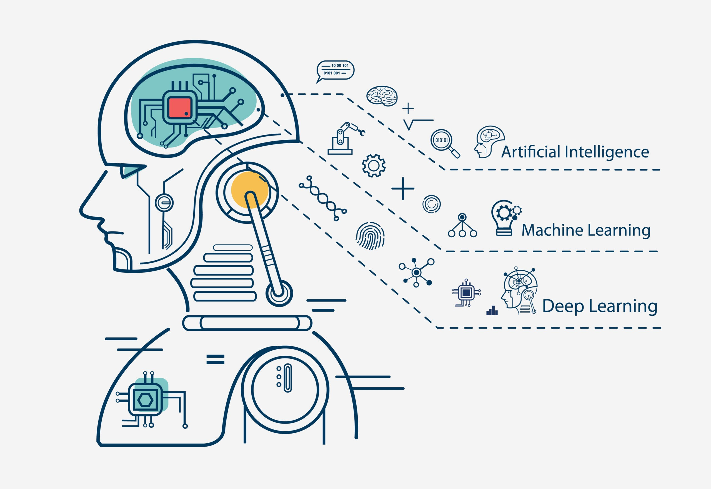

# Free Machine Learning Resources

How to Start Learning Machine Learning: Best Free Online Resources for Beginners?

When beginning your Machine Learning journey, it's helpful to explore free online resources. Start with a short course to grasp basic concepts, providing a solid foundation for your learning path. Numerous online Machine Learning courses, varying in length and cost, are accessible. I advocate for free learning resources, and fortunately, there are so many available for Machine Learning.

## Table of Contents
- [Getting Started](#getting-started)
- [Courses](#courses)
- [Books](#books)
- [Cheat Sheets](#cheat-sheets)
- [Tutorials](#tutorials)
- [Datasets](#datasets)
- [Tools and Libraries](#tools-and-libraries)
- [Blogs and News](#blogs-and-news)
- [Community](#community)

## Getting Started
If you're new to machine learning, start here to grasp the fundamentals.
- [Introduction to Machine Learning](https://www.coursera.org/learn/machine-learning) - Coursera course by Andrew Ng.
- [Machine Learning Yearning](https://github.com/yennhi95zz/ml-resource-collection/tree/main/ML%20Book%20PDF) - A book by Andrew Ng on practical aspects of machine learning.

## Courses
Explore in-depth courses covering a variety of machine learning topics.
- [Fast.ai](https://www.fast.ai/) - Practical deep learning for coders.
- [Stanford Machine Learning](https://see.stanford.edu/Course/CS229) - Stanford University's CS229 course.

## Books
Dive into the world of machine learning with these free books.
- [Python Machine Learning](https://github.com/rasbt/python-machine-learning-book-3rd-edition) - A comprehensive guide by Raschka and Mirjalili.

- [Deep Learning](http://www.deeplearningbook.org/) - The Deep Learning book by Goodfellow, Bengio, and Courville.

- [Mathematics for Machine Learning](https://github.com/mml-book/mml-book.github.io) by Marc Peter Deisenroth, A. Aldo Faisal, and Cheng Soon Ong. Published by Cambridge University Press.

- [Probability and Statistics Cookbook](https://github.com/mavam/stat-cookbook) by Matthias Vallentin

## Cheat Sheets
Quick reference guides for various machine learning concepts and tools.
- [Machine Learning Cheat Sheet](https://ml-cheatsheet.readthedocs.io/) - A comprehensive cheat sheet covering various machine learning concepts and algorithms.

- [NumPy Cheat Sheet](https://s3.amazonaws.com/assets.datacamp.com/blog_assets/Numpy_Python_Cheat_Sheet.pdf) - A quick reference for NumPy, a fundamental package for scientific computing with Python.

- [Pandas Cheat Sheet](https://pandas.pydata.org/Pandas_Cheat_Sheet.pdf) - A concise guide to Pandas, a powerful data manipulation library for Python.

- [Scikit-Learn Cheat Sheet](https://scikit-learn.org/stable/tutorial/machine_learning_map/index.html) - A decision tree to help you choose the right estimator for your machine learning task.

Explore these cheat sheets to simplify your learning and application of key machine learning concepts and tools! Check out the Cheatsheet collection on the [GitHub Repo](https://github.com/yennhi95zz/machine-learning-cheatsheets) for more information.

## Tutorials
Learn specific techniques and practices through hands-on tutorials.
- [TensorFlow Tutorials](https://www.tensorflow.org/tutorials) - Official TensorFlow tutorials for beginners and experts.
- [PyTorch Tutorials](https://pytorch.org/tutorials/) - Dive into PyTorch with these official tutorials.

## Datasets
Access free datasets for your machine learning projects.
- [UCI Machine Learning Repository](http://archive.ics.uci.edu/ml/index.php) - A collection of databases for machine learning research.
- [Kaggle Datasets](https://www.kaggle.com/datasets) - A platform with a variety of datasets and competitions.

## Tools and Libraries
Make use of powerful tools and libraries to streamline your work.
- [scikit-learn](https://scikit-learn.org/stable/) - Simple and efficient tools for machine learning in Python.
- [TensorFlow](https://www.tensorflow.org/) - An open-source machine learning framework.

## Blogs and News
Stay updated with the latest trends and developments in the machine learning world.
- [Towards Data Science](https://towardsdatascience.com/) - Medium publication covering various data science and machine learning topics.
- [KDnuggets](https://www.kdnuggets.com/) - A leading site on AI, Data Science, and Machine Learning.

## Community
Connect with fellow enthusiasts and experts in the machine learning community.
- [Stack Overflow - Machine Learning](https://stackoverflow.com/questions/tagged/machine-learning) - Ask and answer machine learning questions.
- [Reddit - Machine Learning](https://www.reddit.com/r/MachineLearning/) - Join discussions on machine learning topics.

## Contribution
Contributions are welcome! If you have a valuable resource to add, please follow these guidelines:
- Fork the repository
- Create a new branch for your contribution: `git checkout -b feature/new-resource`
- Add your resource and ensure it's well-described
- Commit your changes: `git commit -am 'Add new machine learning resource'`
- Push to the branch: `git push origin feature/new-resource`
- Open a pull request

## License
This project is licensed under the [MIT License](LICENSE), which means you are free to use, modify, and distribute the content for personal or commercial purposes. Attribution is appreciated but not required.

Happy learning!

